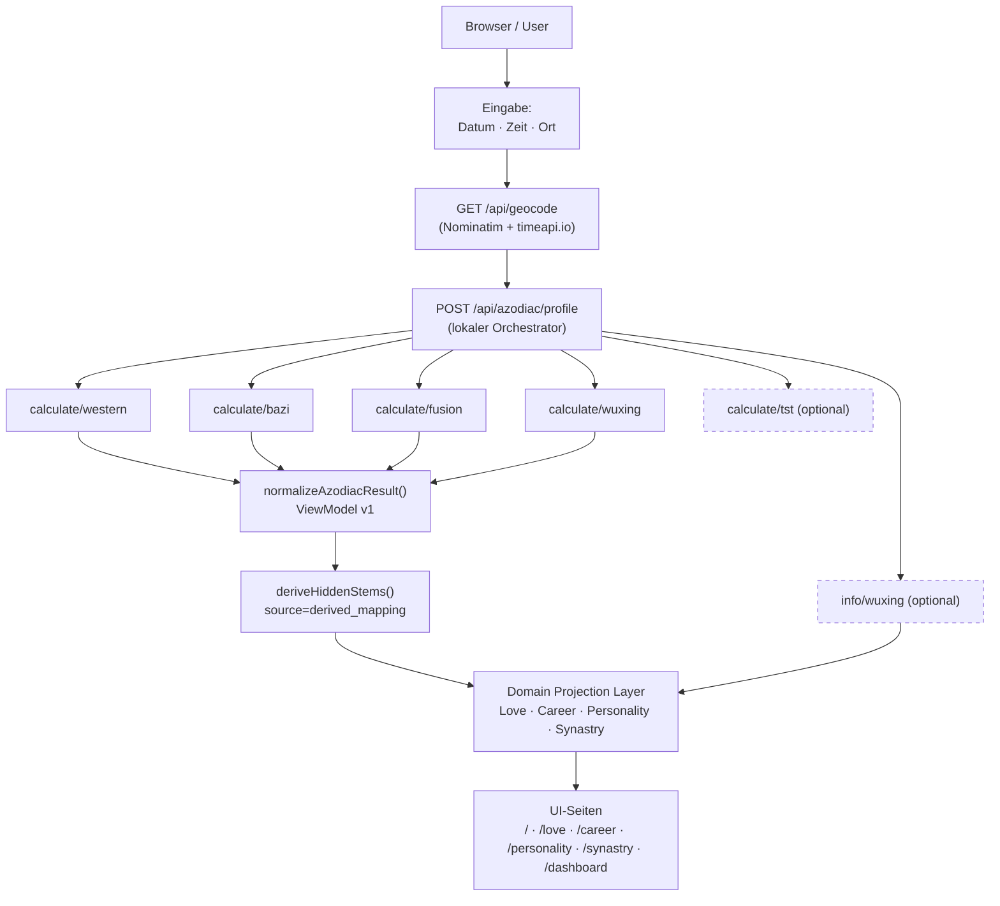

# Azodiac Multi-Page App — Implementierungsfertiger Dev-Brief

> **For Claude Code:** REQUIRED SUB-SKILL: Use `anthropic-skills:executing-plans` to implement this plan task-by-task.
> Führe jeden Task einzeln aus. Markiere ihn als erledigt bevor du den nächsten beginnst.
> Lese jede Datei vor dem Bearbeiten. Verifiziere nach jedem Edit mit `npm test`.

**Stand:** 2026-05-15  
**Repo:** `Full_bazodiac_fufire-main`  
**Arbeitsverzeichnis:** `/Users/benjaminpoersch/Projects/codebase/Full_bazodiac_fufire-main`

---

## 1. Reale Ist-Architektur (Stand 2026-05-15)

### Backend — was wirklich existiert

Node.js ESM-Proxy-Orchestrator, keine externen Abhängigkeiten, Railway-deploybar.

**Infrastructure-Routen:**

| Route | Methode | Status |
|---|---|---|
| `/health` | GET | ✅ live |
| `/api/config` | GET | ✅ live |
| `/api/geocode?q=<ort>` | GET | ✅ live — LRU-Cache (200 Einträge, 24h TTL), Rate Limit (10 req/min/IP) |

**Astro-Proxy-Routen:**

| Route | Methode | Status |
|---|---|---|
| `/chart` | POST | ✅ lokaler Orchestrator: parallel western + bazi + fusion |
| `/calculate/western` | POST | ✅ |
| `/calculate/bazi` | POST | ✅ |
| `/calculate/fusion` | POST | ✅ |
| `/calculate/wuxing` | POST | ✅ |
| `/info/wuxing` | GET | ✅ |
| `/api/azodiac/profile` | POST | ✅ Aggregator: western+bazi+fusion+wuxing (mandatory) + info/wuxing+tst (optional) |
| `/api/fufire/<allowlisted>` | * | ✅ Compatibility Proxy mit Allowlist |

**Implementierte Server-Module:**

| Modul | Status |
|---|---|
| `normalizeAzodiacResult(raw)` | ✅ exportiert, getestet |
| `normalizePillar(raw)` | ✅ löst alle BaZi-Feldaliasse auf |
| `deriveHiddenStems(branch)` | ✅ vollständige 12-Branch-Tabelle (Zàng Gān) |
| `makeGeoCache({maxSize, ttlMs})` | ✅ exportiert, LRU |
| `geocodeRateLimiter({maxPerMinute})` | ✅ exportiert, Sliding-Window per IP |
| CORS via `FUFIRE_ALLOWED_ORIGINS` | ✅ dynamisch gelesen |

**Was der ViewModel aktuell NICHT liefert:**
- Kein `source`-Feld pro ViewModel-Feld
- Kein `fetched_at`-Timestamp
- Kein `confidence`-Score

### Nicht verfügbare Upstream-Endpunkte

Diese existieren upstream noch nicht oder sind nicht verifiziert:

- `GET /ready`, `GET /build`
- `POST /validate`
- `POST /calculate/tst` *(wird in /api/azodiac/profile versucht — Fehler wird absorbiert)*
- `GET /info/wuxing-mapping`
- `GET /transit/now`, `GET /transit/timeline`
- `POST /transit/state`, `POST /transit/narrative`
- `POST /experience/bootstrap`, `/experience/signature-delta`, `/experience/daily`

---

## 2. Zielarchitektur

```
azodiac.space/
├── /                          → Eingabe + Primärübersicht
├── /dashboard                 → Nerd-Dashboard (alle echten API-Responses)
├── /love                      → Liebes- und Partnerschaftshoroskop
├── /career-finance            → Karriere- und Finanzhoroskop
├── /personality               → Ganzheitliches Persönlichkeitshoroskop
├── /synastry                  → Synastrie / Partnervergleich (zwei Geburtsprofile)
├── /transit-calendar          → Transitkalender (erst nach Extension E)
├── /daily                     → Tagespuls / Experience (erst nach Extension F)
└── /debug  (optional)         → API-Status, Raw JSON
```

**Frontend-Stack:** Vanilla HTML/CSS/JS aus `/public/` — kein Build-Schritt, kein Framework-Lock. Alle Seiten werden als HTML-Files in `/public/` angelegt und über den existierenden Static-File-Server ausgeliefert.

---

## 3. Was sofort baubar ist (ohne Backend-Änderungen)

- ✅ Eingabe-Seite (`/api/geocode` + `/api/azodiac/profile`)
- ✅ Primärübersicht mit Kernsatz, BaZi-Säulen, Signatur-Karten
- ✅ Nerd-Dashboard (alle existierenden Endpoints)
- ✅ Domain-Projektionen für Liebe/Karriere/Persönlichkeit (statische Mappings + API-Daten)
- ✅ `source`-Annotation im ViewModel nachrüsten (kleiner Backend-Patch)

## 4. Was Backend-Erweiterung braucht

| Extension | Was | Wann |
|---|---|---|
| A | `GET /api/fufire/catalog` — Discovery | INCREMENT 2 (optional) |
| B | `GET /info/wuxing-mapping` — Alias | INCREMENT 2 (optional) |
| C | `POST /calculate/tst` | nach upstream-Prüfung |
| D | `POST /validate` | nach upstream-Prüfung |
| E | Transit-Endpunkte (4 Routen) | INCREMENT 7 |
| F | Experience-Endpunkte (3 Routen) | INCREMENT 9 |
| G | Synastrie-Orchestrator `/api/azodiac/synastry` | INCREMENT 11 |

---

## 5. Datenflussdiagramm



---

## 6. Endpoint-to-Page Matrix

| Seite | Benötigte Daten | Endpoint | Status | Source Type | Fallback | UI bei Fehler |
|---|---|---|---|---|---|---|
| `/` Eingabe | Geocode | `/api/geocode` | `available_now` | api | manuelle Koordinaten | Fehlermeldung + manuelles Feld |
| `/` Übersicht | Alle Kerndaten | `/api/azodiac/profile` | `available_now` | api_aggregated | `/chart` (kein wuxing) | Teilanzeige mit Hinweis |
| `/` Sonne/Mond/ASC | western.bodies | intern via /profile | `available_now` | api | — | Karte ausgegraut |
| `/` BaZi 4 Säulen | bazi.pillars | intern via /profile | `available_now` | api | — | Karte ausgegraut |
| `/` Hidden Stems | branch → Tabelle | server-side derive | `available_now` | derived_mapping | — | "abgeleitet / unvollständig" |
| `/` Wu-Xing | fusion.wu_xing_vectors | intern via /profile | `available_now` | api | — | Karte ausgegraut |
| `/` Planet-Mapping | info/wuxing | `/info/wuxing` | `available_now` | api | static_fallback | Fallback-Hinweis sichtbar |
| `/dashboard` | Alle Routen | alle oben | `available_now` | mixed | — | Zeile mit Status "failed" |
| `/love` | Venus/Mond/Mars/5./7.H. | intern via /profile | `available_now` | api + static_interpretation | — | Faktor fehlt → Confidence sinkt |
| `/love` | BaZi Day Pillar, DM | intern via /profile | `available_now` | api + derived_mapping | — | Faktor fehlt → Confidence sinkt |
| `/career-finance` | MC, 10./6./2./8.H. | intern via /profile | `available_now` | api + static_interpretation | — | Geburtszeit nötig |
| `/personality` | Alle Kerndaten | `/api/azodiac/profile` | `available_now` | api_aggregated | — | Lücken offen nennen |
| `/synastry` | Zwei Profile | `/api/azodiac/profile` ×2 | `available_now` | api_aggregated | — | Zweites Profil eingeben |
| `/synastry` | Synastrie-Aspekte | `/api/azodiac/synastry` | `backend_extension_required` | api | Basis-Vergleich aus 2×profile | "Vertiefter Vergleich folgt" |
| `/transit-calendar` | Transit-Events | `/transit/now` etc. | `backend_extension_required` | api | — | "Transitdaten noch nicht verfügbar" |
| `/daily` | Tagespuls | `/experience/daily` | `backend_extension_required` | api | — | Feature gesperrt |
| LLM-Narrativ | Erklärung | `/api/narrative` (neu) | `optional_later` | llm_narrative | — | Abschnitt ausgeblendet |

---

## 7. UnifiedAstroProfile Schema

```typescript
type DataSource =
  | 'api'
  | 'api_aggregated'
  | 'derived_mapping'
  | 'static_interpretation'
  | 'static_fallback'
  | 'llm_narrative'
  | 'unavailable';

interface HiddenStem {
  stem:     string;
  element:  string;           // immer DE: Holz/Feuer/Erde/Metall/Wasser
  weight:   number;
  polarity: 'Yin' | 'Yang';
  source:   'derived_from_branch_table' | 'api';
}

interface BaZiPillar {
  stem:         string | null;
  branch:       string | null;
  element:      string | null;
  hidden_stems: HiddenStem[];
}

interface WuXingVector {
  Holz: number; Feuer: number; Erde: number; Metall: number; Wasser: number;
}

interface UnifiedAstroProfile {
  western: {
    bodies:    Record<string, {
      longitude: number; sign: string | null; house: number | null;
      retrograde: boolean; degree_in_sign: number | null;
    }>;
    houses:    Array<{ cusp: number; sign: string }>;
    aspects:   Array<{ planet1: string; planet2: string; type: string; orb: number }>;
    ascendant: string | null;
  };
  bazi: {
    pillars:   { year: BaZiPillar; month: BaZiPillar; day: BaZiPillar; hour: BaZiPillar };
    day_master: BaZiPillar | null;
  };
  fusion: {
    wu_xing_vectors: {
      western_planets: WuXingVector;
      bazi_pillars:    WuXingVector;
      fusion?:         WuXingVector;
    };
    coherence_index:       number | null;
    fusion_interpretation: string;
  };
  wuxing:      { vector: WuXingVector | null };
  tst:         { data: unknown | null };
  wuxing_info: { planet_mapping: Record<string, string> | null };
  _meta: {
    view_model_version: '1';
    input:              { date: string; tz: string; lat: number; lon: number };
    upstream_status:    Record<string, number | 'n/a'>;
    fetched_at:         string;    // ISO 8601 — NEU, fehlt noch
  };
}

// Domain-Projektionstyp (für /love, /career, /personality, /synastry)
interface DomainProjection {
  primaryFactors:    ProjectionFactor[];
  supportingFactors: ProjectionFactor[];
  missingFactors:    string[];          // was fehlt + warum
  sourceTrace:       string[];          // welche Endpunkte/Ableitungen
  confidence:        number;            // 0–1
}

interface ProjectionFactor {
  label:       string;                  // z.B. "Venus in Stier"
  value:       string;                  // z.B. "Erdgebundene Sinnlichkeit"
  source:      DataSource;
  endpoint?:   string;
  note?:       string;
}
```

---

## 8. Inkrementplan

---

### INCREMENT 0 — Backend-Patch + Frontend-Fundament

**Ziel:** `fetched_at` im ViewModel nachrüsten, typisierter API-Client, No-Fake-Data Guard, Shared-Komponenten, Router-Grundgerüst.

---

#### Task 0.1 — `fetched_at` in ViewModel-`_meta` hinzufügen

**Datei:** `server.js`  
**Funktion:** `normalizeAzodiacResult(raw)`

**Schritt 1:** Test schreiben

Datei: `test/view_model.test.js` — neue Assertion in bestehendem Test:
```javascript
test('normalizeAzodiacResult produces stable ViewModel shape', ...);
// Füge hinzu:
assert.ok(typeof result._meta.fetched_at === 'string', 'fetched_at must be a string');
assert.doesNotThrow(() => new Date(result._meta.fetched_at), 'fetched_at must be valid ISO date');
```

**Schritt 2:** Test ausführen
```bash
cd /Users/benjaminpoersch/Projects/codebase/Full_bazodiac_fufire-main
node --test test/view_model.test.js
```
Erwartet: FAIL auf `fetched_at`

**Schritt 3:** Implementation

In `normalizeAzodiacResult()`, im return-Statement, `_meta`-Block:
```javascript
_meta: {
  ...meta,
  view_model_version: '1',
  fetched_at: new Date().toISOString(),  // NEU
},
```

**Schritt 4:** Test ausführen
```bash
node --test test/view_model.test.js
```
Erwartet: alle Tests PASS

**Schritt 5:** Vollständige Suite
```bash
node --test
```
Erwartet: 18 pass, 5 skip, 0 fail

**Schritt 6:** Commit
```bash
git add server.js test/view_model.test.js
git commit -m "feat: add fetched_at ISO timestamp to ViewModel _meta"
```

---

#### Task 0.2 — Typed API-Client-Modul

**Neue Datei:** `public/src/api/client.js`

**Schritt 1:** Verzeichnis anlegen
```bash
mkdir -p /Users/benjaminpoersch/Projects/codebase/Full_bazodiac_fufire-main/public/src/api
```

**Schritt 2:** Datei schreiben

```javascript
// public/src/api/client.js
// Typed API Client für Azodiac — alle Requests über diese Schicht
// Response Envelope: { endpoint, fetchedAt, ok, status, data, error }

const BASE = '';  // same-origin

async function request(method, path, body = null) {
  const opts = {
    method,
    headers: { 'accept': 'application/json' },
  };
  if (body !== null) {
    opts.headers['content-type'] = 'application/json';
    opts.body = JSON.stringify(body);
  }
  const fetchedAt = new Date().toISOString();
  try {
    const res = await fetch(`${BASE}${path}`, opts);
    let data = null;
    let error = null;
    try {
      data = await res.json();
    } catch (e) {
      error = 'Response war kein gültiges JSON';
    }
    if (!res.ok && !error) error = data?.error || `HTTP ${res.status}`;
    return { endpoint: path, fetchedAt, ok: res.ok, status: res.status, data, error };
  } catch (e) {
    return { endpoint: path, fetchedAt, ok: false, status: 0, data: null, error: e.message };
  }
}

export async function calculateProfile(input) {
  return request('POST', '/api/azodiac/profile', input);
}

export async function geocodePlace(q) {
  return request('GET', `/api/geocode?q=${encodeURIComponent(q)}`);
}

export async function getConfig() {
  return request('GET', '/api/config');
}

export async function getHealth() {
  return request('GET', '/health');
}

export function noFakeDataGuard(data, label = '') {
  if (typeof process !== 'undefined' && process.env?.NODE_ENV !== 'development') return;
  const DUMMY_SIGNATURES = ['Lorem', 'dummy', 'fake', 'random', 'placeholder', 'test123'];
  const str = JSON.stringify(data || '');
  for (const sig of DUMMY_SIGNATURES) {
    if (str.includes(sig)) {
      throw new Error(`[noFakeDataGuard] Dummy-Wert "${sig}" in "${label}" entdeckt — nur echte API-Daten erlaubt.`);
    }
  }
}
```

**Schritt 3:** Commit
```bash
git add public/src/api/client.js
git commit -m "feat: typed API client module with response envelope"
```

---

#### Task 0.3 — Shared-Komponenten

**Neue Dateien:**
- `public/src/components/UnavailableCard.js`
- `public/src/components/SourceBadge.js`
- `public/src/components/ConfidenceBar.js`

**Datei: `public/src/components/UnavailableCard.js`**

```javascript
// Zeigt einen Leer-Zustand an — immer motivierend, nie defensiv
export function UnavailableCard({ title, reason, action = null }) {
  const el = document.createElement('div');
  el.className = 'unavailable-card';
  el.innerHTML = `
    <span class="unavailable-icon">◌</span>
    <h3 class="unavailable-title">${title}</h3>
    <p class="unavailable-reason">${reason}</p>
    ${action ? `<button class="unavailable-action">${action.label}</button>` : ''}
  `;
  if (action) {
    el.querySelector('.unavailable-action').addEventListener('click', action.handler);
  }
  return el;
}
```

**Datei: `public/src/components/SourceBadge.js`**

```javascript
// Zeigt die Datenherkunft eines Wertes
const SOURCE_LABELS = {
  api:                  { label: 'API',         color: '#22c55e' },
  api_aggregated:       { label: 'Aggregiert',  color: '#3b82f6' },
  derived_mapping:      { label: 'Abgeleitet',  color: '#a855f7' },
  static_interpretation:{ label: 'Bedeutung',   color: '#f59e0b' },
  static_fallback:      { label: 'Fallback',    color: '#f97316' },
  llm_narrative:        { label: 'KI-Text',     color: '#64748b' },
  unavailable:          { label: 'Fehlt',       color: '#ef4444' },
};

export function SourceBadge(source) {
  const cfg = SOURCE_LABELS[source] || { label: source, color: '#64748b' };
  const el = document.createElement('span');
  el.className = 'source-badge';
  el.style.cssText = `background:${cfg.color}22;color:${cfg.color};border:1px solid ${cfg.color}44;
    font-size:0.65rem;padding:1px 6px;border-radius:4px;letter-spacing:0.05em;font-weight:600;`;
  el.textContent = cfg.label;
  return el;
}
```

**Datei: `public/src/components/ConfidenceBar.js`**

```javascript
// Visueller Confidence-Indicator (0–1)
export function ConfidenceBar(value, { label = 'Vollständigkeit' } = {}) {
  const pct = Math.round((value ?? 0) * 100);
  const color = pct >= 70 ? '#22c55e' : pct >= 40 ? '#f59e0b' : '#ef4444';
  const el = document.createElement('div');
  el.className = 'confidence-bar';
  el.innerHTML = `
    <span class="confidence-label">${label}</span>
    <div class="confidence-track">
      <div class="confidence-fill" style="width:${pct}%;background:${color};"></div>
    </div>
    <span class="confidence-pct" style="color:${color}">${pct}%</span>
  `;
  return el;
}
```

**Schritt:** Commit
```bash
git add public/src/components/
git commit -m "feat: shared UI components — UnavailableCard, SourceBadge, ConfidenceBar"
```

---

#### Task 0.4 — Einfacher Hash-Router

**Neue Datei:** `public/src/router.js`

```javascript
// Leichtgewichtiger Hash-Router
// Verwendung: router.register('/love', LovePage); router.start();

const routes = new Map();
let currentCleanup = null;

export const router = {
  register(path, mountFn) {
    routes.set(path, mountFn);
    return this;
  },

  navigate(path) {
    window.location.hash = path;
  },

  start() {
    const handle = () => {
      const hash = window.location.hash.replace('#', '') || '/';
      const mount = routes.get(hash) || routes.get('*');
      if (currentCleanup) currentCleanup();
      const app = document.getElementById('app');
      if (!app) return;
      app.innerHTML = '';
      if (mount) currentCleanup = mount(app) || null;
    };
    window.addEventListener('hashchange', handle);
    handle();
  },
};
```

**Schritt:** Commit
```bash
git add public/src/router.js
git commit -m "feat: lightweight hash router"
```

---

### INCREMENT 1A — Eingabe-Seite

**Ziel:** Motivierende, zugängliche Eingabemaske — Datum, Zeit, Ort — mit Geocode-Autocomplete und progressivem Lade-Flow.

---

#### Task 1A.1 — GeoInput-Komponente

**Neue Datei:** `public/src/components/GeoInput.js`

```javascript
// Geocode-Autocomplete mit Debounce, Tastaturnavigation, Fallback
import { geocodePlace } from '../api/client.js';

export function GeoInput({ onSelect }) {
  const wrapper = document.createElement('div');
  wrapper.className = 'geo-input-wrapper';
  wrapper.innerHTML = `
    <input type="text" class="geo-input" placeholder="Geburtsort eingeben…"
      autocomplete="off" aria-label="Geburtsort" aria-autocomplete="list" aria-haspopup="listbox" />
    <div class="geo-dropdown" role="listbox" aria-label="Ortsvorschläge"></div>
    <div class="geo-selected" hidden>
      <span class="geo-selected-name"></span>
      <span class="geo-selected-coords"></span>
      <button class="geo-change-btn" type="button" aria-label="Ort ändern">Ändern</button>
    </div>
    <div class="geo-manual" hidden>
      <label>Lat <input type="number" class="geo-lat" step="0.001" /></label>
      <label>Lon <input type="number" class="geo-lon" step="0.001" /></label>
      <label>Zeitzone <input type="text" class="geo-tz" placeholder="Europe/Berlin" /></label>
    </div>
    <button class="geo-manual-toggle" type="button">Koordinaten manuell eingeben</button>
  `;

  const input      = wrapper.querySelector('.geo-input');
  const dropdown   = wrapper.querySelector('.geo-dropdown');
  const selected   = wrapper.querySelector('.geo-selected');
  const changeBtn  = wrapper.querySelector('.geo-change-btn');
  const manualDiv  = wrapper.querySelector('.geo-manual');
  const manualBtn  = wrapper.querySelector('.geo-manual-toggle');

  let debounceTimer = null;
  let results = [];
  let activeIdx = -1;

  function showDropdown(places) {
    results = places;
    activeIdx = -1;
    dropdown.innerHTML = '';
    if (!places.length) {
      dropdown.innerHTML = '<div class="geo-no-result">Kein Ort gefunden</div>';
      dropdown.hidden = false;
      return;
    }
    places.forEach((p, i) => {
      const item = document.createElement('div');
      item.className = 'geo-option';
      item.setAttribute('role', 'option');
      item.setAttribute('data-idx', i);
      item.textContent = p.display;
      item.addEventListener('click', () => selectPlace(p));
      dropdown.appendChild(item);
    });
    dropdown.hidden = false;
  }

  function selectPlace(p) {
    dropdown.hidden = true;
    input.hidden = true;
    selected.hidden = false;
    wrapper.querySelector('.geo-selected-name').textContent = p.display.split(',')[0];
    wrapper.querySelector('.geo-selected-coords').textContent = `${p.lat.toFixed(3)}, ${p.lon.toFixed(3)} · ${p.tz}`;
    onSelect?.({ display: p.display, lat: p.lat, lon: p.lon, tz: p.tz });
  }

  changeBtn.addEventListener('click', () => {
    selected.hidden = true;
    input.hidden = false;
    input.value = '';
    input.focus();
    onSelect?.(null);
  });

  manualBtn.addEventListener('click', () => {
    manualDiv.hidden = !manualDiv.hidden;
    if (!manualDiv.hidden) {
      manualDiv.querySelector('.geo-lat').addEventListener('change', syncManual);
      manualDiv.querySelector('.geo-lon').addEventListener('change', syncManual);
      manualDiv.querySelector('.geo-tz').addEventListener('change', syncManual);
    }
  });

  function syncManual() {
    const lat = Number(manualDiv.querySelector('.geo-lat').value);
    const lon = Number(manualDiv.querySelector('.geo-lon').value);
    const tz  = manualDiv.querySelector('.geo-tz').value.trim() || 'UTC';
    if (lat && lon) onSelect?.({ display: `${lat}, ${lon}`, lat, lon, tz });
  }

  input.addEventListener('keydown', (e) => {
    const items = dropdown.querySelectorAll('.geo-option');
    if (e.key === 'ArrowDown') { activeIdx = Math.min(activeIdx + 1, items.length - 1); }
    if (e.key === 'ArrowUp')   { activeIdx = Math.max(activeIdx - 1, 0); }
    if (e.key === 'Enter' && activeIdx >= 0) selectPlace(results[activeIdx]);
    if (e.key === 'Escape') dropdown.hidden = true;
    items.forEach((el, i) => el.classList.toggle('active', i === activeIdx));
  });

  input.addEventListener('input', () => {
    clearTimeout(debounceTimer);
    const q = input.value.trim();
    if (q.length < 2) { dropdown.hidden = true; return; }
    debounceTimer = setTimeout(async () => {
      const res = await geocodePlace(q);
      if (res.ok && Array.isArray(res.data)) showDropdown(res.data);
      else showDropdown([]);
    }, 300);
  });

  document.addEventListener('click', (e) => {
    if (!wrapper.contains(e.target)) dropdown.hidden = true;
  });

  return wrapper;
}
```

**Schritt:** Commit
```bash
git add public/src/components/GeoInput.js
git commit -m "feat: GeoInput autocomplete with keyboard navigation"
```

---

#### Task 1A.2 — Progressiver Lade-Flow

**Neue Datei:** `public/src/components/CalculationProgress.js`

```javascript
// Progressiver Lade-Flow: kein Spinner, sondern Schritte mit Text
export function CalculationProgress() {
  const steps = [
    { id: 'western', label: 'Westliches Chart wird berechnet…' },
    { id: 'bazi',    label: 'BaZi-Säulen werden ermittelt…' },
    { id: 'fusion',  label: 'Wu-Xing-Fusion wird berechnet…' },
    { id: 'done',    label: 'Dein Profil ist fertig.' },
  ];

  const el = document.createElement('div');
  el.className = 'calc-progress';
  el.setAttribute('role', 'status');
  el.setAttribute('aria-live', 'polite');

  let current = 0;
  el.innerHTML = `<p class="calc-step">${steps[0].label}</p>`;

  const interval = setInterval(() => {
    current++;
    if (current >= steps.length - 1) { clearInterval(interval); }
    el.querySelector('.calc-step').textContent = steps[Math.min(current, steps.length - 1)].label;
  }, 900);

  el.stop = () => clearInterval(interval);

  return el;
}
```

---

#### Task 1A.3 — Eingabe-Seite zusammenbauen

**Neue Datei:** `public/src/pages/InputPage.js`

```javascript
import { GeoInput } from '../components/GeoInput.js';
import { CalculationProgress } from '../components/CalculationProgress.js';
import { calculateProfile } from '../api/client.js';

export function InputPage(app, { onResult }) {
  app.innerHTML = `
    <main class="input-page">
      <header class="input-header">
        <h1 class="app-title">Azodiac</h1>
        <p class="app-subtitle">Westliche Astrologie · BaZi · Wu-Xing-Fusion</p>
      </header>
      <form class="birth-form" novalidate>
        <div class="form-group">
          <label for="birth-date">Geburtsdatum</label>
          <input type="date" id="birth-date" required aria-required="true" />
        </div>
        <div class="form-group">
          <label for="birth-time">Geburtszeit</label>
          <input type="time" id="birth-time" />
          <div class="time-certainty" role="group" aria-label="Geburtszeit-Genauigkeit">
            <label><input type="radio" name="time-cert" value="exact" checked /> Genau bekannt</label>
            <label><input type="radio" name="time-cert" value="approx" /> Ungefähr</label>
            <label><input type="radio" name="time-cert" value="unknown" /> Unbekannt</label>
          </div>
        </div>
        <div class="form-group" id="geo-group">
          <label>Geburtsort</label>
        </div>
        <div class="form-error" role="alert" aria-live="assertive" hidden></div>
        <button type="submit" class="cta-btn" disabled>Berechnen</button>
      </form>
    </main>
  `;

  const form       = app.querySelector('.birth-form');
  const dateInput  = form.querySelector('#birth-date');
  const timeInput  = form.querySelector('#birth-time');
  const geoGroup   = form.querySelector('#geo-group');
  const submitBtn  = form.querySelector('.cta-btn');
  const errorEl    = form.querySelector('.form-error');

  let selectedPlace = null;

  const geoInput = GeoInput({
    onSelect: (place) => {
      selectedPlace = place;
      validate();
    },
  });
  geoGroup.appendChild(geoInput);

  function validate() {
    const hasDate  = !!dateInput.value;
    const hasPlace = !!selectedPlace;
    submitBtn.disabled = !(hasDate && hasPlace);
  }

  dateInput.addEventListener('input', validate);

  form.addEventListener('submit', async (e) => {
    e.preventDefault();
    errorEl.hidden = true;

    const cert    = form.querySelector('input[name=time-cert]:checked').value;
    const timeVal = cert !== 'unknown' ? timeInput.value : '12:00';

    const input = {
      date: dateInput.value,
      time: timeVal,
      lat:  selectedPlace.lat,
      lon:  selectedPlace.lon,
      tz:   selectedPlace.tz,
    };

    // Zeige progressiven Lade-Flow
    const progress = CalculationProgress();
    form.replaceWith(progress);

    const res = await calculateProfile(input);
    progress.stop();

    if (!res.ok || !res.data) {
      form.querySelector('.form-error').textContent =
        res.error || 'Berechnung nicht möglich — bitte erneut versuchen.';
      form.querySelector('.form-error').hidden = false;
      progress.replaceWith(form);
      return;
    }

    // Ergänze Metadaten für Übersicht
    res.data._inputMeta = {
      timeCertainty: cert,
      location: selectedPlace.display,
    };

    onResult?.(res.data);
  });
}
```

**Schritt:** Commit
```bash
git add public/src/pages/InputPage.js public/src/components/CalculationProgress.js
git commit -m "feat: InputPage with geocode, time-certainty, progressive load flow"
```

---

### INCREMENT 1B — Primärübersicht

**Ziel:** Emotionale Hierarchie: Kernsatz → BaZi-Säulen → Signatur-Karten. Keine flachen Datentabellen.

---

#### Task 1B.1 — Domain-Modul: Kernsatz

**Neue Datei:** `public/src/domain/coreStatement.js`

```javascript
// Deterministischer Kernsatz — kein LLM, reine statische Tabelle
// Quelle: Day Master + Sun Sign + Coherence Index

const DM_TRAITS = {
  甲: { name: 'Yang-Holz', core: 'Aufwärtswachstum und Pioniergeist' },
  乙: { name: 'Yin-Holz',  core: 'Anpassungsfähige Ausdauer' },
  丙: { name: 'Yang-Feuer', core: 'Strahlende Wärme und Führungskraft' },
  丁: { name: 'Yin-Feuer',  core: 'Tiefe Empfindsamkeit und inneres Licht' },
  戊: { name: 'Yang-Erde',  core: 'Zuverlässige Substanz und Beständigkeit' },
  己: { name: 'Yin-Erde',   core: 'Nährende Tiefe und feines Gespür' },
  庚: { name: 'Yang-Metall', core: 'Entschlossenheit und klare Struktur' },
  辛: { name: 'Yin-Metall',  core: 'Präzision und raffinierte Schönheit' },
  壬: { name: 'Yang-Wasser', core: 'Bewegliche Intelligenz und Weitsicht' },
  癸: { name: 'Yin-Wasser',  core: 'Intuition und stille Tiefe' },
};

const SUN_SIGN_SHORT = {
  Aries: 'Widder', Taurus: 'Stier', Gemini: 'Zwillinge', Cancer: 'Krebs',
  Leo: 'Löwe', Virgo: 'Jungfrau', Libra: 'Waage', Scorpio: 'Skorpion',
  Sagittarius: 'Schütze', Capricorn: 'Steinbock', Aquarius: 'Wassermann', Pisces: 'Fische',
};

export function generateCoreStatement(profile) {
  const dm = profile?.bazi?.day_master?.stem;
  const sun = profile?.western?.bodies?.Sun;
  const ci  = profile?.fusion?.coherence_index;

  if (!dm && !sun) return null;

  let parts = [];

  if (dm && DM_TRAITS[dm]) {
    const t = DM_TRAITS[dm];
    parts.push(`Dein Day Master ${dm} (${t.name}) steht für ${t.core}`);
  }

  if (sun?.sign) {
    const sign = SUN_SIGN_SHORT[sun.sign] || sun.sign;
    parts.push(`trifft auf eine Sonne im ${sign}`);
  }

  if (ci !== null && ci !== undefined) {
    const cohText = ci >= 0.7
      ? '— eine hohe innere Deckungsgleichheit'
      : ci <= 0.35
      ? '— eine kreative Spannung zwischen östlichem und westlichem Selbstbild'
      : '— eine ausgewogene Mischung aus Stabilität und Entwicklung';
    parts.push(cohText);
  }

  return parts.length ? parts.join(' ') + '.' : null;
}
```

---

#### Task 1B.2 — Domain-Modul: BaZi-Säulen-Renderer

**Neue Datei:** `public/src/domain/baziRenderer.js`

```javascript
import { SourceBadge } from '../components/SourceBadge.js';

const PILLAR_LABELS = { year: 'Jahr', month: 'Monat', day: 'Tag', hour: 'Stunde' };

export function renderBaziPillars(bazi, { timeCertainty = 'exact' } = {}) {
  const wrapper = document.createElement('div');
  wrapper.className = 'bazi-pillars';

  const pillars = bazi?.pillars || {};

  ['year', 'month', 'day', 'hour'].forEach((key) => {
    const p = pillars[key];
    const col = document.createElement('div');
    col.className = `bazi-pillar bazi-pillar--${key}`;

    if (!p || !p.stem) {
      col.innerHTML = `<span class="pillar-label">${PILLAR_LABELS[key]}</span>
        <span class="pillar-empty">—</span>`;
      if (key === 'hour' && timeCertainty === 'unknown') {
        col.querySelector('.pillar-empty').textContent = 'Geburtszeit unbekannt';
        col.classList.add('bazi-pillar--uncertain');
      }
      wrapper.appendChild(col);
      return;
    }

    const hsBadge = p.hidden_stems?.length
      ? p.hidden_stems[0].source === 'derived_from_branch_table'
        ? SourceBadge('derived_mapping')
        : SourceBadge('api')
      : null;

    col.innerHTML = `
      <span class="pillar-label">${PILLAR_LABELS[key]}</span>
      <span class="pillar-stem" title="Himmelsstamm">${p.stem || '—'}</span>
      <span class="pillar-branch" title="Erdzweig">${p.branch || '—'}</span>
      <span class="pillar-element">${p.element || ''}</span>
      <details class="pillar-hidden-stems">
        <summary>藏干 Verborgene Stämme</summary>
        <div class="hs-list"></div>
      </details>
    `;

    if (hsBadge) col.querySelector('.pillar-label').appendChild(hsBadge);

    const hsList = col.querySelector('.hs-list');
    (p.hidden_stems || []).forEach((hs) => {
      const row = document.createElement('div');
      row.className = 'hs-row';
      row.innerHTML = `<span class="hs-stem">${hs.stem}</span>
        <span class="hs-el">${hs.element}</span>
        <span class="hs-pol">${hs.polarity}</span>
        <span class="hs-weight">${hs.weight}</span>`;
      hsList.appendChild(row);
    });

    wrapper.appendChild(col);
  });

  return wrapper;
}
```

---

#### Task 1B.3 — Primärübersicht-Seite

**Neue Datei:** `public/src/pages/OverviewPage.js`

```javascript
import { generateCoreStatement } from '../domain/coreStatement.js';
import { renderBaziPillars }     from '../domain/baziRenderer.js';
import { SourceBadge }           from '../components/SourceBadge.js';
import { UnavailableCard }       from '../components/UnavailableCard.js';
import { ConfidenceBar }         from '../components/ConfidenceBar.js';

const SIGN_DE = {
  Aries:'Widder', Taurus:'Stier', Gemini:'Zwillinge', Cancer:'Krebs',
  Leo:'Löwe', Virgo:'Jungfrau', Libra:'Waage', Scorpio:'Skorpion',
  Sagittarius:'Schütze', Capricorn:'Steinbock', Aquarius:'Wassermann', Pisces:'Fische',
};

function signDE(s) { return s ? (SIGN_DE[s] || s) : null; }

export function OverviewPage(app, { profile, onNavigate }) {
  const timeCert = profile._inputMeta?.timeCertainty || 'exact';
  const coreStatement = generateCoreStatement(profile);

  const missing = [];
  if (timeCert === 'unknown') missing.push('Stundenhoroskop (Geburtszeit unbekannt)');
  if (!profile.western?.ascendant && timeCert !== 'unknown') missing.push('Aszendent');
  if (!profile.western?.bodies?.Sun?.sign) missing.push('Sonnenzeichen');

  // Signatur-Karten sammeln
  const cards = [];

  const sun = profile.western?.bodies?.Sun;
  if (sun?.sign) cards.push({ title: 'Sonne', value: signDE(sun.sign), source: 'api', note: null });
  else cards.push(null); // Platzhalter

  const moon = profile.western?.bodies?.Moon;
  if (moon?.sign) cards.push({ title: 'Mond', value: signDE(moon.sign), source: 'api' });

  if (profile.western?.ascendant) {
    cards.push({ title: 'Aszendent', value: signDE(profile.western.ascendant), source: 'api' });
  } else {
    cards.push({
      unavailable: true,
      title: 'Aszendent',
      reason: timeCert === 'unknown'
        ? 'Für den Aszendenten brauchst du deine genaue Geburtszeit. Weißt du sie?'
        : 'Aszendent wird vom API nicht geliefert.',
      action: timeCert === 'unknown'
        ? { label: 'Geburtszeit nachschlagen', handler: () => onNavigate?.('/') }
        : null,
    });
  }

  const dm = profile.bazi?.day_master;
  if (dm?.stem) cards.push({ title: 'Day Master', value: `${dm.stem} ${dm.element || ''}`, source: 'api' });

  const ci = profile.fusion?.coherence_index;
  if (ci !== null && ci !== undefined) {
    const pct = Math.round(ci * 100);
    cards.push({ title: 'Fusion-Kohärenz', value: `${pct}%`, source: 'api_aggregated',
      note: 'Deckungsgleichheit deiner westlichen und östlichen Signatur' });
  }

  // Layout aufbauen
  app.innerHTML = `
    <main class="overview-page">
      <nav class="page-nav">
        <a href="#/love" class="nav-link">Liebe</a>
        <a href="#/career-finance" class="nav-link">Karriere</a>
        <a href="#/personality" class="nav-link">Persönlichkeit</a>
        <a href="#/dashboard" class="nav-link">Dashboard</a>
      </nav>

      <section class="core-statement-section" aria-label="Kernsatz">
        ${coreStatement
          ? `<p class="core-statement">${coreStatement}</p>`
          : '<p class="core-statement--empty">Zu wenige Daten für einen Kernsatz.</p>'
        }
      </section>

      <section class="bazi-section" aria-label="BaZi Vier Säulen">
        <h2>BaZi — Vier Säulen</h2>
        <div class="bazi-pillars-wrapper"></div>
        ${missing.length ? `<p class="missing-note">Hinweis: ${missing.join(', ')}</p>` : ''}
      </section>

      <section class="signature-cards-section" aria-label="Signatur-Karten">
        <h2>Deine Signatur</h2>
        <div class="cards-grid"></div>
      </section>

      <footer class="overview-footer">
        <button class="new-calc-btn">Neue Berechnung</button>
      </footer>
    </main>
  `;

  // BaZi-Säulen einfügen
  app.querySelector('.bazi-pillars-wrapper')
    .appendChild(renderBaziPillars(profile.bazi, { timeCertainty: timeCert }));

  // Signatur-Karten einfügen
  const grid = app.querySelector('.cards-grid');
  cards.forEach((card) => {
    if (!card) return;
    if (card.unavailable) {
      grid.appendChild(UnavailableCard({
        title: card.title,
        reason: card.reason,
        action: card.action,
      }));
      return;
    }
    const el = document.createElement('div');
    el.className = 'signature-card';
    el.innerHTML = `
      <div class="card-header">
        <h3 class="card-title">${card.title}</h3>
      </div>
      <div class="card-value">${card.value}</div>
      ${card.note ? `<p class="card-note">${card.note}</p>` : ''}
    `;
    el.querySelector('.card-header').appendChild(SourceBadge(card.source));
    grid.appendChild(el);
  });

  app.querySelector('.new-calc-btn').addEventListener('click', () => onNavigate?.('/'));
}
```

**Schritt:** Commit
```bash
git add public/src/domain/ public/src/pages/OverviewPage.js
git commit -m "feat: OverviewPage — CoreStatement, BaZi-Säulen, Signatur-Karten"
```

---

#### Task 1B.4 — index.html als App-Shell verdrahten

**Datei:** `public/index.html` — bestehende Datei refaktorieren zur App-Shell

Die Datei soll nur noch das Grundgerüst enthalten. Alle Inhalte kommen dynamisch per JS.

Minimaler App-Shell-Inhalt:
```html
<!DOCTYPE html>
<html lang="de">
<head>
  <meta charset="UTF-8" />
  <meta name="viewport" content="width=device-width, initial-scale=1.0" />
  <title>Azodiac</title>
  <link rel="stylesheet" href="src/styles/main.css" />
</head>
<body>
  <div id="app" role="main"></div>
  <script type="module" src="src/app.js"></script>
</body>
</html>
```

**Neue Datei:** `public/src/app.js`
```javascript
import { router } from './router.js';
import { InputPage } from './pages/InputPage.js';
import { OverviewPage } from './pages/OverviewPage.js';

let currentProfile = null;

router
  .register('/', (app) => {
    InputPage(app, {
      onResult: (profile) => {
        currentProfile = profile;
        router.navigate('/overview');
      },
    });
  })
  .register('/overview', (app) => {
    if (!currentProfile) { router.navigate('/'); return; }
    OverviewPage(app, {
      profile: currentProfile,
      onNavigate: (path) => router.navigate(path),
    });
  })
  .start();
```

**Neue Datei:** `public/src/styles/main.css` — Basis-Stylesheet (angelegt, leer, wird schrittweise befüllt)

**Schritt:** Commit
```bash
git add public/index.html public/src/app.js public/src/styles/main.css
git commit -m "feat: app shell + router wiring — InputPage und OverviewPage verbunden"
```

---

### INCREMENT 2 — Nerd-Dashboard

**Route:** `/dashboard`  
**Ziel:** Alle echten API-Responses sichtbar, kein Fake-Wert, klar was existiert vs. geplant.

**Neue Datei:** `public/src/pages/DashboardPage.js`

Zeigt:
- Endpoint-Matrix: alle Routen mit HTTP-Status
- Raw-JSON-Viewer pro Endpoint (aufklappbar, `<details>`)
- Normalized ViewModel (diff: rein → raus)
- Sektion "Geplante Erweiterungen" mit: Transitkalender, Experience/Daily, Synastrie-Vertiefung, LLM-Narrativ — alle als "noch nicht verfügbar" markiert

**Schritt:** Commit nach Fertigstellung
```bash
git commit -m "feat: DashboardPage — Endpoint-Matrix, Raw-JSON-Viewer, geplante Erweiterungen"
```

---

### INCREMENT 3 — Domain-Projektions-Layer

**Ziel:** Gemeinsame Logik für Liebe, Karriere, Persönlichkeit.

**Neue Datei:** `public/src/domain/projections.js`

```javascript
// Alle Projektionen geben DomainProjection zurück:
// { primaryFactors, supportingFactors, missingFactors, sourceTrace, confidence }

export function createLoveProjection(profile) { /* Venus, Mond, Mars, 5./7.H., Day Pillar, WuXing */ }
export function createCareerProjection(profile) { /* MC, 10./6.H., Sonne, Saturn, Month Pillar */ }
export function createFinanceProjection(profile) { /* 2./8.H., Venus, Jupiter, WuXing Ressource */ }
export function createPersonalityProjection(profile) { /* alle Schichten, Widersprüche benennen */ }
```

Regeln:
- `confidence` sinkt wenn Schlüsselfaktoren fehlen (z.B. Venus fehlt → love.confidence ≤ 0.6)
- Keine LLM-Werte
- Keine Finanzberatung, keine Diagnosen

**Schritt:** Commit nach Fertigstellung
```bash
git commit -m "feat: domain projection layer — love, career, finance, personality"
```

---

### INCREMENT 4 — Liebe & Partnerschaft

**Route:** `/love`

**Emotionale Hierarchie:**
```
1. HEADLINE (was prägt deine Liebeswelt — 1 Satz)
2. "Was fließt leicht" — Karten mit Faktoren + SourceBadge
3. "Was braucht Bewusstsein" — Spannungsfelder, kein "schlechtes Zeichen"
4. "Was fehlt noch" — ehrlich, motivierend: "Ohne 5. Haus (Geburtszeit nötig) bleibt dieser Bereich unvollständig"
5. Wu-Xing Beziehungsmuster (Holz nährt Feuer etc.)
```

Keine deterministischen Liebesversprechen. Formulierungen: "symbolisch", "tendiert zu", "deutet auf".

**Schritt:** Commit nach Fertigstellung
```bash
git commit -m "feat: LovePage — emotionale Hierarchie, Faktorkarten, WuXing-Muster"
```

---

### INCREMENT 5 — Karriere & Finanzen

**Route:** `/career-finance` — Tabs: Karriere / Finanzen

Faktoren Karriere: MC, 10./6.H., Sonne, Saturn, Jupiter, BaZi Month Pillar, Elementstruktur.  
Faktoren Finanzen: 2./8.H., Venus, Jupiter, Saturn, Wu-Xing Ressourcenmuster.

Klarer Disclaimer: "Keine Finanzberatung."  
Keine günstigen/ungünstigen Termine ohne echte Transitdaten.

---

### INCREMENT 6 — Ganzheitliches Persönlichkeitshoroskop

**Route:** `/personality`

Alle Schichten. Widersprüche zwischen BaZi und Western-Chart werden als interessant benannt, nicht als Fehler. Lücken offen nennen. Keine psychologische Diagnose.

---

### INCREMENT 7 — Transit-Backend-Erweiterung

> ⚠️ Diese Extension darf erst implementiert werden, wenn ein Contract-Test gegen den Upstream grün ist.

Zu prüfen: Existieren `GET /transit/now`, `GET /transit/timeline`, `POST /transit/state`, `POST /transit/narrative` upstream?

**Vorgehen:**
1. Manueller Curl-Test gegen `https://bafe-production.up.railway.app/transit/now`
2. Contract-Test schreiben (opt-in, wie die bestehenden)
3. Bei grünem Test: Allowlist erweitern, Route hinzufügen
4. Erst danach: UI für Transitkalender

---

### INCREMENT 8 — Transitkalender

**Route:** `/transit-calendar`  
**Voraussetzung:** INCREMENT 7 bestanden.

UI:
- Ansichten: Monat / Woche / Liste
- Filter: Liebe / Karriere / Finanzen / Persönlichkeit / Gesamt
- Intensität: niedrig / mittel / hoch
- Ton: unterstützend / herausfordernd / gemischt / neutral
- Wu-Xing-Overlay: Holz / Feuer / Erde / Metall / Wasser
- Day Drawer: Ereignis, Faktoren, Datenquelle, Deutung, Unsicherheit

Keine "guter Tag für Investment"-Aussagen. Formulierungen: "symbolisches Reflexionsfenster".

---

### INCREMENT 9 — Experience/Daily Backend + UI

**Voraussetzung:** Upstream `POST /experience/bootstrap`, `/signature-delta`, `/daily` sind per Contract-Test verifiziert.

Danach:
- Daily Layer in Primärübersicht
- Experience Layer in /personality
- Optional Daily Cards im Transitkalender

---

### INCREMENT 10 — LLM-Narrativ-Layer

**Route:** `/api/narrative` (neu, serverseitig)

Regeln:
- OpenRouter API-Key nur serverseitig (ENV)
- LLM erklärt nur, berechnet nie
- Fehlende Daten benennen, nicht erfinden
- App funktioniert vollständig ohne LLM
- LLM-Ausfall bricht keine Kernseite

---

### INCREMENT 11 — Synastrie / Partnervergleich

**Route:** `/synastry`

**Was sofort möglich ist (ohne neue Backend-Route):**
- Zwei getrennte Profile via `/api/azodiac/profile` laden
- Basis-Vergleich: Wu-Xing-Kompatibilität (Elementzyklus — nährt, kontrolliert, neutral)
- BaZi Day-Master-Interaktion (statische Tabelle)
- Aspekte zwischen den westlichen Charts manuell berechnen (client-seitig, wenn Planetenpositionen bekannt)

**Was Backend-Extension G braucht:**
- `POST /api/azodiac/synastry` — nimmt zwei Payload-Objekte, berechnet Synastrie-Aspekte server-seitig
- Contract-Test bevor UI die vertieften Daten nutzt

**UI-Struktur:**
```
PERSON A | PERSON B — Eingabe je eine Zeile
→ [Beide berechnen]

SEKTION 1: Wu-Xing-Kompatibilität (sofort, aus Basis-Profilen)
SEKTION 2: BaZi-Resonanz (Day Master × Day Master — statische Tabelle)
SEKTION 3: Westliche Aspekte zwischen den Charts (wenn Positionen vorhanden)
SEKTION 4: Vertiefter Synastrie-Report (erst nach Extension G + Contract-Test)
```

---

## 9. Akzeptanzkriterien (global)

- [ ] Kein UI zeigt Dummy- oder Fake-Werte in Produktion
- [ ] API-Ausfall → strukturierter Fehlerzustand, kein Absturz
- [ ] Fehlende Felder → motivierende, ehrliche Formulierung (kein "nicht geliefert")
- [ ] Jede Aussage ist auf einen konkreten Datenpunkt zurückführbar
- [ ] Keine Finanzberatung, keine psychologische Diagnose
- [ ] Keine Transitaussagen ohne Transitdaten
- [ ] `npm test` grün vor jedem Inkrement-Abschluss
- [ ] Mobilzugriff: alle Kernseiten auf 375px ohne horizontalen Scroll nutzbar
- [ ] Kontrast ≥ 4.5:1 für Lesetext
- [ ] Keine Secrets im Frontend-Bundle
- [ ] Synastrie: zweiter Input immer optional — App läuft ohne ihn

---

## 10. Testplan

### Backend (bereits vorhanden ✅ oder zu ergänzen 🔲)

- [x] Health-Endpunkt
- [x] Config-Endpunkt
- [x] Geocode fehlendes q-Param
- [x] Allowlist-Methoden-Checks
- [x] Invalid-JSON-Rejection
- [x] Upstream-Forwarding
- [x] Unbekannter Endpoint → 404
- [x] CORS — Wildcard ohne Allowlist-Env
- [x] CORS — Restriktiv mit Allowlist
- [x] ViewModel — normalizePillar Hidden Stems aus Tabelle
- [x] ViewModel — missing subsections graceful
- [x] Geocode-Cache — Hit / LRU-Eviction / TTL
- [x] Rate Limiter — Block nach Threshold / IP-Isolation
- [x] Contract-Tests (opt-in)
- 🔲 `fetched_at` in `_meta` — ISO-String vorhanden (Task 0.1)

### Frontend (zu ergänzen)

- 🔲 API-Client — Envelope-Struktur bei Erfolg
- 🔲 API-Client — Envelope-Struktur bei Netzwerkfehler
- 🔲 GeoInput — Debounce feuert nicht bei < 2 Zeichen
- 🔲 GeoInput — Tastaturnavigation wählt korrekten Eintrag
- 🔲 GeoInput — manuelle Koordinaten-Eingabe propagiert onSelect
- 🔲 InputPage — Submit-Button disabled ohne Datum + Ort
- 🔲 InputPage — Zeit "unbekannt" übergibt 12:00 an API
- 🔲 OverviewPage — Aszendent-UnavailableCard bei unbekannter Zeit
- 🔲 OverviewPage — Kernsatz nur wenn Day Master oder Sonne vorhanden
- 🔲 OverviewPage — Hidden-Stems-Badge zeigt "Abgeleitet" bei derived_mapping
- 🔲 DashboardPage — zeigt Raw-JSON aller Endpoints
- 🔲 DomainProjection — confidence < 1 wenn Schlüsselfaktor fehlt
- 🔲 DomainProjection — sourceTrace enthält alle genutzten Felder
- 🔲 Mobile-Layout — 375px ohne horizontalen Scroll
- 🔲 Synastrie — zweites Profil optional, App läuft ohne es

### Transit (erst nach Extension E)

- 🔲 Contract-Test Transit-Endpunkte grün (opt-in)
- 🔲 Transitkalender-Events nur aus echten Transit-Daten
- 🔲 Event sourceTrace nachvollziehbar
- 🔲 Filter-Logik korrekt
- 🔲 Kein "guter Tag für Investment" als Aussage

---

## 11. Risiken und Gegenmaßnahmen

| Risiko | W'keit | Maßnahme |
|---|---|---|
| FuFirE-Upstream ändert Feldnamen | mittel | Contract-Tests + ViewModel-Normalisierung als Puffer |
| Geburtszeit fehlt bei 40%+ der User | hoch | Time-Unknown-Flow von Anfang an — kein Nachrüsten |
| Hidden-Stems-Tabelle enthält Fehler | niedrig | Quellenangabe "derived_from_branch_table", Unit-Tests |
| Transit-Upstream nicht verfügbar | hoch | Kalender erst bauen wenn Contract-Test grün |
| LLM halluziniert Astro-Werte | hoch | LLM bekommt nur berechnete Daten, nie rohe Eingaben |
| Datenschutz: Geburtsdaten persistent | mittel | Keine Persistenz ohne explizites User-Opt-in |
| Synastrie-Vertiefung ohne Backend | gering | Basis-Vergleich aus 2×profile reicht für INCREMENT 11a |

---

## 12. Features-auf-dem-Weg — wann sie kommen

Diese Features gehören zum Produkt — sie sind aus den ersten Inkrementen rausgehalten, weil die nötigen Daten oder Backend-Routen noch fehlen:

| Feature | Warum nicht in Inc. 0–3 | Wann |
|---|---|---|
| **Transitkalender** | Transit-Upstream-Endpunkte existieren noch nicht lokal | INCREMENT 8 (nach Extension E + Contract-Test) |
| **LLM-Narrativ-Texte** | Braucht stabiles Datenfundament + serverseitigen Narrativ-Endpunkt | INCREMENT 10 (letzter Schritt) |
| **Synastrie / Partnervergleich** | Braucht zwei Input-Datensätze, Basis läuft via 2×/api/azodiac/profile | INCREMENT 11a (sofort) + 11b (nach Extension G) |
| **Experience / Tagespuls** | Experience-Upstream-Endpunkte nicht verifiziert | INCREMENT 9 (nach Extension F + Contract-Test) |
| **Persistenz / Benutzerprofile** | Auth + DB — eigenes Inkrement, kein Scope jetzt | Nach INCREMENT 6 |

---

*Dev-Brief Version 2 — 2026-05-15 · Nächste Revision nach INCREMENT 1B*
